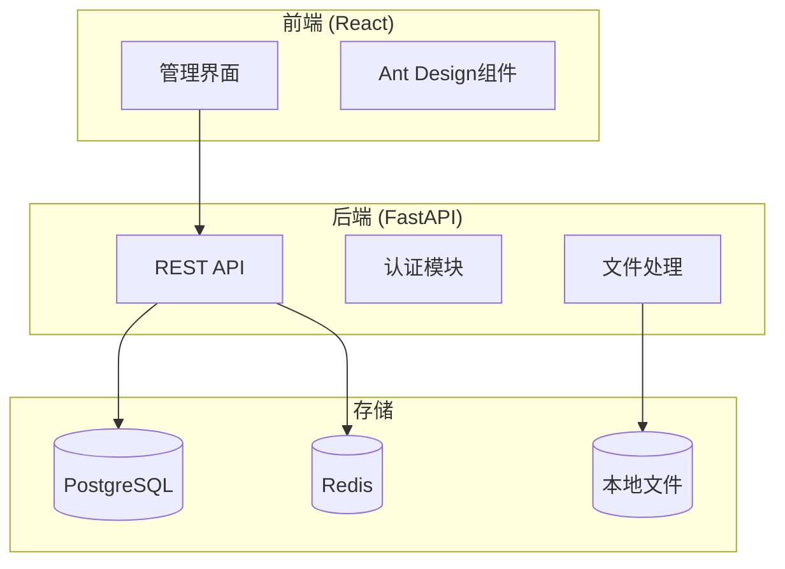

# 数据标注平台 - 快速开发架构方案

## 开发策略：分阶段渐进式

### 阶段1：Streamlit 快速原型 (3-5天)
**目标**：验证核心功能可行性，快速展示demo

#### 技术栈
```python
Streamlit + SQLite + Pandas
├── 前端: Streamlit (纯Python)
├── 数据库: SQLite (轻量级)
├── 数据处理: Pandas + json
└── 文件存储: 本地文件系统
```

#### 核心功能实现
```python
# streamlit_app.py
import streamlit as st
import pandas as pd
import json
from pathlib import Path

def main():
    st.set_page_config(page_title="数据标注平台", layout="wide")
    
    # 侧边栏导航
    page = st.sidebar.selectbox("选择功能", [
        "任务配置", "数据标注", "进度管理", "结果导出"
    ])
    
    if page == "任务配置":
        task_config_page()
    elif page == "数据标注":
        annotation_page()
    elif page == "进度管理":
        progress_page()
    elif page == "结果导出":
        export_page()

def task_config_page():
    st.header("任务配置")
    
    # 文件上传
    uploaded_file = st.file_uploader(
        "上传JSONL文件", 
        type=['jsonl'],
        help="请上传包含待标注数据的JSONL文件"
    )
    
    if uploaded_file:
        # 解析文件
        data = load_jsonl(uploaded_file)
        st.success(f"成功加载 {len(data)} 条数据")
        
        # 字段配置
        if data:
            configure_fields(data[0])
        
        # 标注配置
        configure_annotation()

def configure_fields(sample_data):
    st.subheader("字段配置")
    
    fields = list(sample_data.keys())
    selected_fields = st.multiselect("选择要展示的字段", fields, default=fields)
    
    field_types = {}
    for field in selected_fields:
        field_types[field] = st.selectbox(
            f"{field} 的数据类型",
            ["text", "image", "code", "pdf"],
            key=f"type_{field}"
        )
    
    # 保存配置
    if st.button("保存字段配置"):
        save_field_config(selected_fields, field_types)
        st.success("字段配置已保存")

def configure_annotation():
    st.subheader("标注配置")
    
    annotation_type = st.selectbox(
        "标注形式",
        ["单选", "多选", "打分", "文本输入"]
    )
    
    if annotation_type in ["单选", "多选"]:
        options = st.text_area(
            "选项列表 (每行一个选项)",
            placeholder="选项1\n选项2\n选项3"
        ).split('\n')
        options = [opt.strip() for opt in options if opt.strip()]
    
    if st.button("保存标注配置"):
        save_annotation_config(annotation_type, options if annotation_type in ["单选", "多选"] else None)
        st.success("标注配置已保存")

def annotation_page():
    st.header("数据标注")
    
    # 加载任务数据
    if 'current_index' not in st.session_state:
        st.session_state.current_index = 0
    
    data = load_task_data()
    if not data:
        st.warning("请先配置任务")
        return
    
    # 显示当前数据
    current_data = data[st.session_state.current_index]
    display_data(current_data)
    
    # 标注界面
    annotation_result = render_annotation_form()
    
    # 导航按钮
    col1, col2, col3 = st.columns(3)
    with col1:
        if st.button("上一条") and st.session_state.current_index > 0:
            st.session_state.current_index -= 1
            st.rerun()
    
    with col2:
        if st.button("保存标注"):
            save_annotation(st.session_state.current_index, annotation_result)
            st.success("标注已保存")
    
    with col3:
        if st.button("下一条") and st.session_state.current_index < len(data) - 1:
            st.session_state.current_index += 1
            st.rerun()

def display_data(data):
    st.subheader("待标注数据")
    
    field_config = load_field_config()
    for field, field_type in field_config.items():
        if field in data:
            st.write(f"**{field}:**")
            
            if field_type == "text":
                st.text_area("", data[field], disabled=True, key=f"display_{field}")
            elif field_type == "code":
                st.code(data[field], language="sql")
            elif field_type == "image":
                if Path(data[field]).exists():
                    st.image(data[field])
                else:
                    st.error(f"图片文件不存在: {data[field]}")
            elif field_type == "pdf":
                if Path(data[field]).exists():
                    st.write(f"PDF文件: {data[field]}")
                    # 简单显示PDF路径，实际项目中需要PDF预览组件
                else:
                    st.error(f"PDF文件不存在: {data[field]}")

def render_annotation_form():
    config = load_annotation_config()
    
    if config['type'] == "单选":
        return st.radio("请选择", config['options'])
    elif config['type'] == "多选":
        return st.multiselect("请选择", config['options'])
    elif config['type'] == "打分":
        return st.slider("评分", 1, 10, 5)
    elif config['type'] == "文本输入":
        return st.text_area("请输入标注内容")

# 工具函数
def load_jsonl(file):
    content = file.read().decode('utf-8')
    lines = content.strip().split('\n')
    return [json.loads(line) for line in lines if line.strip()]

def save_field_config(fields, types):
    config = {"fields": fields, "types": types}
    with open("field_config.json", "w") as f:
        json.dump(config, f)

def load_field_config():
    try:
        with open("field_config.json", "r") as f:
            config = json.load(f)
            return config["types"]
    except:
        return {}

def save_annotation_config(annotation_type, options):
    config = {"type": annotation_type, "options": options}
    with open("annotation_config.json", "w") as f:
        json.dump(config, f)

def load_annotation_config():
    try:
        with open("annotation_config.json", "r") as f:
            return json.load(f)
    except:
        return {"type": "单选", "options": ["选项1", "选项2"]}

def load_task_data():
    try:
        with open("task_data.json", "r") as f:
            return json.load(f)
    except:
        return []

def save_annotation(index, result):
    # 保存标注结果到文件
    annotations = load_annotations()
    annotations[str(index)] = result
    with open("annotations.json", "w") as f:
        json.dump(annotations, f)

def load_annotations():
    try:
        with open("annotations.json", "r") as f:
            return json.load(f)
    except:
        return {}

if __name__ == "__main__":
    main()
```

#### 优势
- **3-5天完成核心功能**
- **即时验证需求**
- **快速展示给stakeholder**
- **低成本试错**

### 阶段2：生产级架构 (1-2周)
**目标**：基于原型验证结果，开发生产级系统

#### 优化的技术栈选择

##### 方案A：单体应用 + 现代框架 (推荐)
```
FastAPI + React + PostgreSQL
├── 后端: FastAPI (Python)
├── 前端: React + Ant Design
├── 数据库: PostgreSQL
├── 缓存: Redis
└── 部署: Docker + Docker Compose
```

**为什么选择这个组合？**
1. **FastAPI**: 
   - 自动生成API文档
   - 类型提示减少bug
   - 高性能异步处理
   - 学习曲线平缓

2. **React + Ant Design**:
   - 组件库丰富，开发快速
   - 社区成熟，问题解决容易
   - 支持复杂交互

3. **PostgreSQL**:
   - JSON字段支持灵活数据结构
   - 成熟稳定，性能优秀

##### 方案B：Django 全栈 (适合Python团队)
```
Django + Django REST + Vue.js
├── 后端: Django + DRF
├── 前端: Vue.js + Element UI
├── 数据库: PostgreSQL
└── 缓存: Redis
```

**优势**：
- Django admin 提供现成的管理界面
- ORM 功能强大，开发速度快
- 内置用户认证系统
- 大量第三方包

##### 方案C：全栈框架 (最快开发)
```
Next.js 全栈 + Prisma
├── 全栈: Next.js (React + Node.js)
├── ORM: Prisma
├── 数据库: PostgreSQL
├── 部署: Vercel/Netlify
```

**优势**：
- 前后端统一技术栈
- 全栈开发效率最高
- 部署简单

## 🎯 推荐方案：FastAPI + React

考虑到你的需求，我强烈推荐 **FastAPI + React** 方案：

### 开发效率优化点

#### 1. 使用代码生成工具
```bash
# 自动生成API客户端
npm install @openapitools/openapi-generator-cli
openapi-generator-cli generate -i http://localhost:8000/openapi.json -g typescript-axios -o ./src/api
```

#### 2. 使用 UI 模板
```bash
# 使用 Ant Design Pro 模板
npx create-react-app my-app --template typescript
npm install @ant-design/pro-components
```

#### 3. 数据库快速设置
```python
# 使用 SQLModel (FastAPI + SQLAlchemy)
from sqlmodel import SQLModel, Field, create_engine

class Task(SQLModel, table=True):
    id: Optional[int] = Field(default=None, primary_key=True)
    name: str
    config: dict = Field(sa_column=Column(JSON))
```

#### 4. 认证系统快速集成
```python
# 使用 FastAPI-Users
pip install fastapi-users[sqlalchemy,oauth]
```

### 简化架构图



### 开发时间估算

| 功能模块 | Streamlit原型 | 生产级系统 |
|---------|--------------|-----------|
| 文件上传 | 0.5天 | 1天 |
| 字段配置 | 1天 | 2天 |
| 标注配置 | 1天 | 2天 |
| 标注界面 | 1天 | 3天 |
| 进度管理 | 0.5天 | 1天 |
| 用户管理 | 0天 | 1天 |
| 部署配置 | 0.5天 | 1天 |
| **总计** | **4.5天** | **11天** |

## 📋 实施建议

### 第一周：Streamlit 原型
1. **Day 1-2**: 基础框架 + 文件上传
2. **Day 3**: 字段配置 + 数据展示
3. **Day 4**: 标注界面 + 基础交互
4. **Day 5**: 完善功能 + demo演示

### 第二周：生产系统
1. **Day 1-2**: FastAPI后端基础架构
2. **Day 3-4**: React前端基础组件
3. **Day 5**: 核心功能集成测试

### 验证策略
1. **原型阶段**: 用真实数据测试核心流程
2. **生产阶段**: 逐模块替换，保证功能连续性
3. **性能测试**: 模拟多用户并发操作

你觉得这个分阶段方案如何？我们可以立即开始 Streamlit 原型开发，还是你希望直接进入生产级架构？
